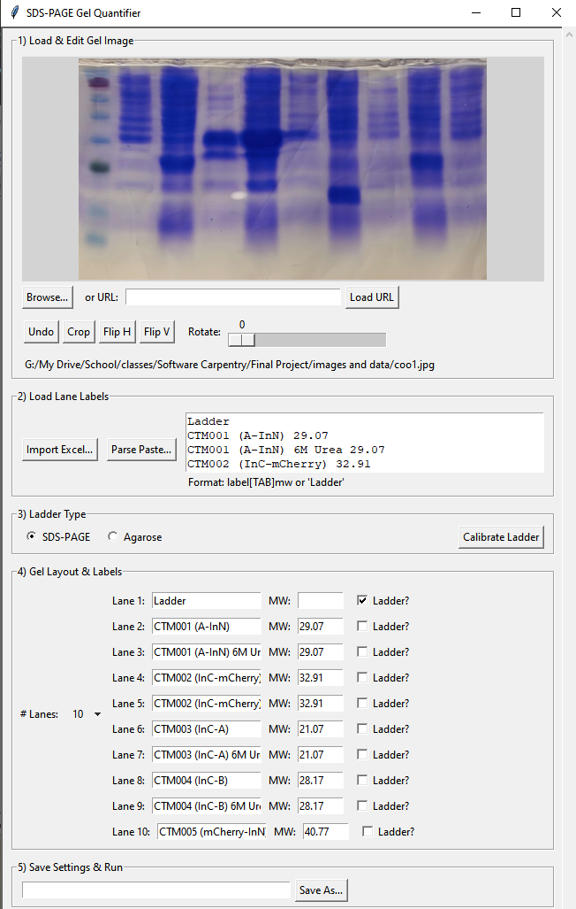
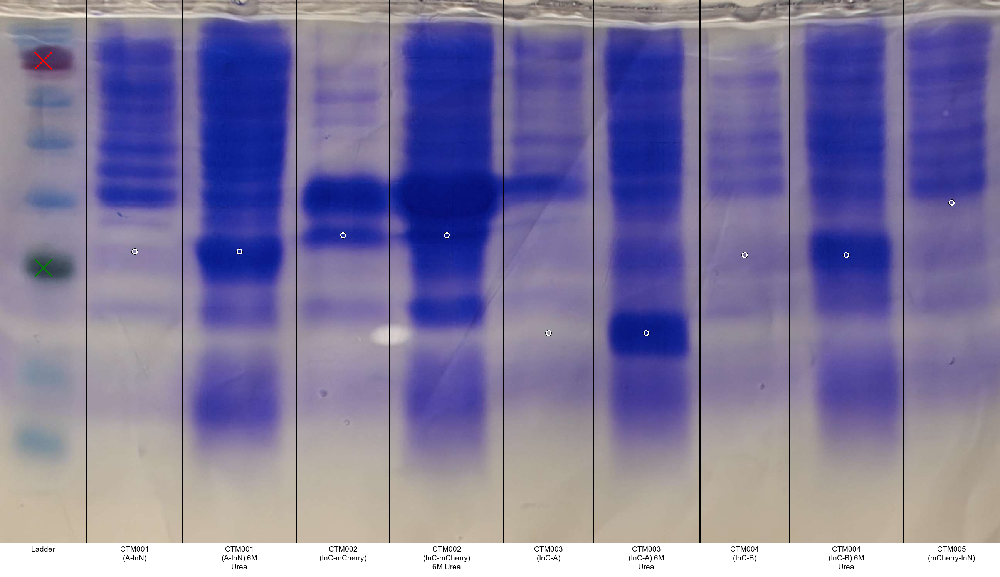

# GelGUI

Final project for Software Carpentry Spring 2025 at Johns Hopkins University

Project Title: GelGUI

This is a simple GUI meant to automatically label agarose and SDS-Page gels to save time and increase replicability. 
It can take an image in that was taken with a phone, crop/rotate/flip it, then marks boundaries between lanes and 
expected band locations via user-provided data. Annotated image can be saved at a location selected in the last step. 
Band locations are determined via ladder bands, which are manually calibrated before use (since this was way more accurate
than having it try to detect every ladder band, then determine color, which was rarely successful or precise). 

Input:
Image of gel
Lane data - sample name (label) & size
	Expected format in excel is that first column is label and second column is size. See example image below

Example of the program when first opened  


Example of the program after data has been input  


Example of what format it's looking for in excel  


Example of output  



## Usage

```bash
python final.py

-Drag & drop or browse to open your gel image
-Click Calibrate Ladder, click the two ladder bands in the pop‐up
-Import or paste your lane labels & MWs
-Choose SDS-PAGE vs Agarose
-Click Run Quantification and save your annotated gel


## Structure

Final/
├── data/               ← example outputs & sample .xlsx  
├── docs/               ← handout PDFs & Word docs  
├── images/             ← README screenshots  
├── final.py            ← main GUI code  
├── requirements.txt  
└── README.md


## To-do
Test on agarose gels
Adjust lane boundary detection so that it doesn't try to put extra boundaries in empty lanes
Size labels according to their individual lane width instead of by the minimum lane width
Package as an .exe maybe?


## Acknowledgements

- Drag-and-drop support powered by [tkinterdnd2](https://pypi.org/project/tkinterdnd2/)  
- Image processing via [Pillow](https://python-pillow.org/)  
- Data parsing via [pandas](https://pandas.pydata.org/)  
- HTTP fetching via [Requests](https://requests.readthedocs.io/)  
- ChatGPT for questions regarding formatting and tkinter [ChatGPT](https://chatgpt.com/)


## License

This software was developed as coursework for Johns Hopkins University’s Software Carpentry class and is not intended for public redistribution.  
&copy; 2025 Carl Ty Mellor. All rights reserved.
